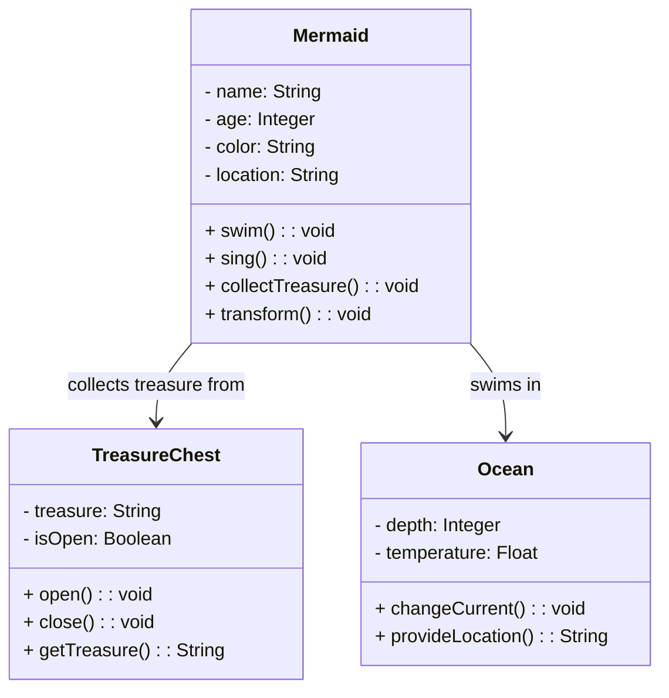
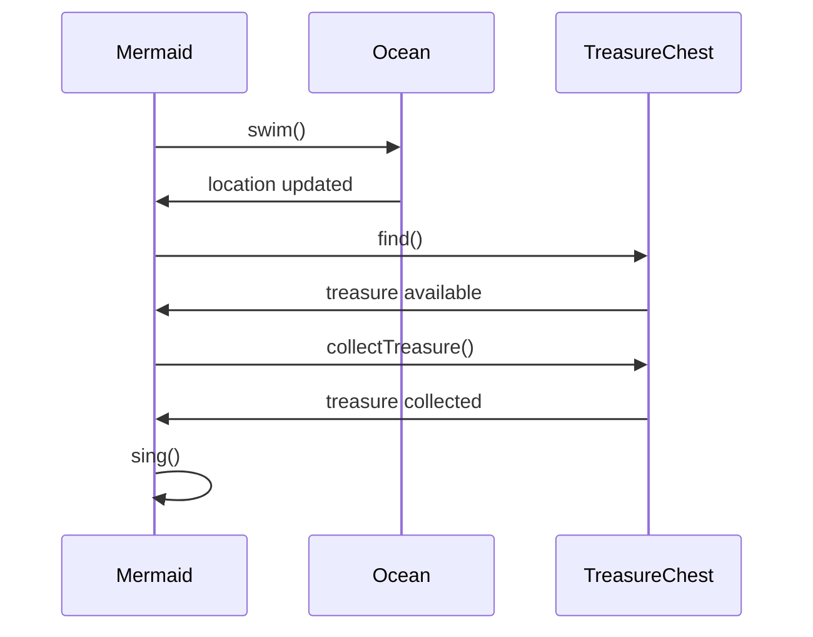

# Concepts

## Class Diagram

```mermaid
classDiagram
    class Mermaid {
        - name: String
        - age: Integer
        - color: String
        - location: String
        + swim(): void
        + sing(): void
        + collectTreasure(): void
        + transform(): void
    }

    class TreasureChest {
        - treasure: String
        - isOpen: Boolean
        + open(): void
        + close(): void
        + getTreasure(): String
    }

    class Ocean {
        - depth: Integer
        - temperature: Float
        + changeCurrent(): void
        + provideLocation(): String
    }

    Mermaid --> TreasureChest : collects treasure from
    Mermaid --> Ocean : swims in
```

## Sequence Diagram

```mermaid
sequenceDiagram
    participant Mermaid
    participant Ocean
    participant TreasureChest

    Mermaid ->> Ocean: swim()
    Ocean ->> Mermaid: location updated
    Mermaid ->> TreasureChest: find()
    TreasureChest ->> Mermaid: treasure available
    Mermaid ->> TreasureChest: collectTreasure()
    TreasureChest ->> Mermaid: treasure collected
    Mermaid ->> Mermaid: sing()
```
